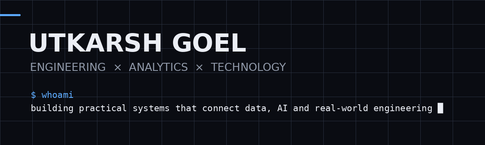

<div align="center">



<br/>


### Building practical systems at the intersection of **data, AI & engineering**

<a href="https://github.com/utkarsh-goel18"></a>
<a href="https://www.linkedin.com/"></a>

</div>

---

## `01` — what I build

I like projects where **technology solves a concrete problem** — especially around analytics, finance, AI, automation and connected hardware.

```text
DATA / ANALYTICS       →      AI / AUTOMATION
        ↘                       ↙
          REAL-WORLD PRODUCTS
        ↗                       ↖
   FINTECH / BUSINESS      IoT / HARDWARE
```

## `02` — selected work

| Project | What it is | Stack |
|---|---|---|
| **[LoanLens](https://github.com/utkarsh-goel18/loanlens)** | AI-powered loan risk & financial analysis | Python · ML · Finance |
| **[Consulting-in-a-Box](https://github.com/utkarsh-goel18/Consulting-in-a-Box)** | Practical analytics / consulting toolkit | Python · Analytics |
| **[Blender Copilot](https://github.com/utkarsh-goel18/blender-copilot)** | Automation layer for Blender workflows | Python · Blender API · AI |
| **[Momentum](https://github.com/utkarsh-goel18/momentum-ai)** | Goal & productivity platform | React · Tailwind · Firebase |

## `03` — toolkit

```text
LANGUAGES       Python · C++ · SQL · C
DATA            PostgreSQL · Power BI
AI / ML         Python ML stack · LLM workflows
ENGINEERING     ESP32 · Arduino · Sensors
PRODUCT         React · Firebase
3D / TOOLS      Blender · Git · GitHub
```

## `04` — currently

- Building stronger **data + business analytics** projects
- Practising **DSA in C++**
- Learning **Power BI & PostgreSQL**
- Exploring the intersection of **AI, FinTech and real-world systems**

## `05` — philosophy

> **Don't just build software. Build something that has a reason to exist.**

<div align="center">

### ↓ explore the repositories ↓

</div>
